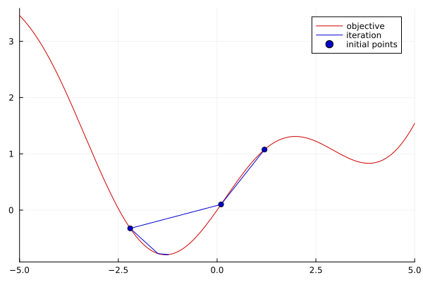

# QuadraticInterpolationMethod

[](https://github.com/hyrodium/QuadraticInterpolationMethod.jl/actions/workflows/CI.yml?query=branch%3Amain)

Quadratic interpolation method is an optimization method by interpolating given evaluation points with a quadratic polynomial.

## 1-dim example
```julia-repl
julia> using QuadraticInterpolationMethod: optimize!

julia> f(x) = sin(x) + x^2/10  # Function to minimize
f (generic function with 1 method)

julia> xs_init = [1.2, 0.1, -2.2]  # Initial points (3 points are required to construct parabola)
3-element Vector{Float64}:
  1.2
  0.1
 -2.2

julia> xs = copy(xs_init)  # Keep initial points
3-element Vector{Float64}:
  1.2
  0.1
 -2.2

julia> optimize!(f, xs, 10)  # Optimize 10 steps
13-element Vector{Float64}:
  1.2
  0.1
 -2.2
 -1.4980661244174434
 -1.2293686986818357
 -1.3061365335230135
 -1.3059492270208548
 -1.3064424808417185
 -1.3064400170208186
 -1.306440099017006
 -1.3066465256797584
 -1.306452471584103
 -1.3064400463690848

julia> using Plots

julia> pl = plot(f; xlims=(-5,5), color=:red3, label="objective")

julia> plot!(pl, xs, f.(xs); color=:blue3, label="iteration")

julia> scatter!(pl, xs_init, f.(xs_init); color=:blue3, label="initial points")
```



## 2-dim example

```julia
using QuadraticInterpolationMethod: optimize!
using StaticArrays
import Random
using Plots

f(x,y) = x^2 + sin(x) + 1.5y^2 + sinh(y) - x*y/5
Random.seed!(42)
xs_init = rand(6)
ys_init = rand(6)
ps_init = [SVector(x,y) for (x,y) in zip(xs_init, ys_init)]
ps = copy(ps_init)
optimize!(f, ps, 20)
xs_plot = -3:0.1:3
ys_plot = -5:0.1:3
zs_plot = f.(xs_plot', ys_plot)
plot(xs_plot, ys_plot, zs_plot; levels=-40:40, label="objective")
plot!([p[1] for p in ps], [p[2] for p in ps]; color=:blue2, label="iteration")
scatter!(xs_init, ys_init, label="initial points")
```


